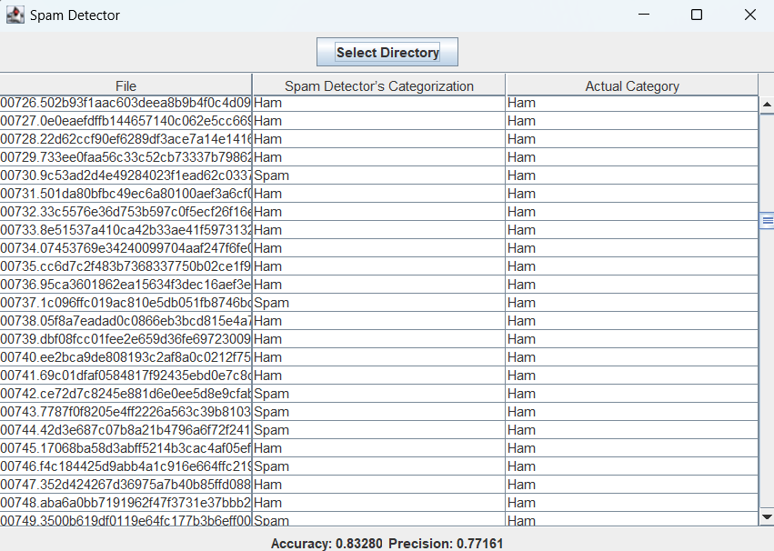

# Assignment Submission

Shown above is our working spam detector. We updated the table display to show the filename and the predicted classification, and the actual classification. 

## How to run
Clone the repository using the following command
```
git clone https://github.com/OntarioTech-CS-program/w25-csci2020u-assignment01-a1-marshall-fernandes-haider
```
Navigate to the project directory
```
cd w25-csci2020u-assignment01-a1-marshall-fernandes-haider
```
run the project
```
java csci2020u.assignment01.SpamDetectorGUI
```
when using the application click the "Select Directory" button and navigate to the 'data' folder and load it into the program. The program will then display the results in the table, along with the accuracy and precision of the model.

### References
[1] https://en.wikipedia.org/wiki/Bag-of-words_model

[2] https://en.wikipedia.org/wiki/Naive_Bayes_spam_filtering
